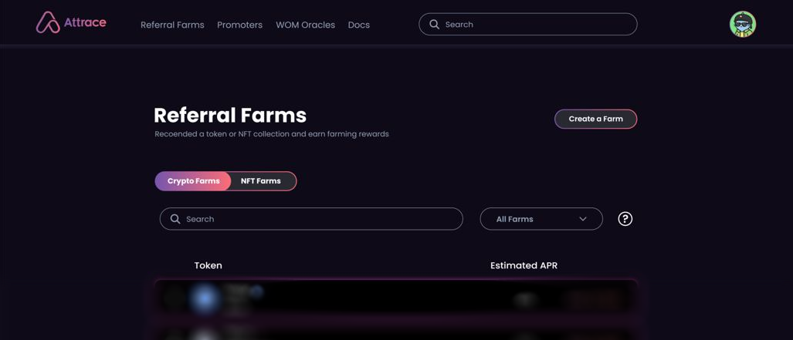

Attrace Product Update
In 2021, Attrace went live with its revised proposition, a methodology for referrals in anticipation of web3. The protocol has already been rolled out to Ethereum and Polygon, inaugurating the world’s first cross-chain trustless referrals. Attrace also passed the key milestone of more than 1,000 Participants “observed”, currently at +1,500. Traction is also strong on the Project / Crypto Creator side with many projects in the pipeline, especially in the NFT space.

In a nutshell, the world’s first referrals for web3 is showing traction and adoption, especially on the Project / Crypto Creator side, where performance has been significantly better than anticipated.
<!--truncate-->
## Word Of Mouth marketing (WOM) in web3

Web3 brings opportunities to channel value directly to those that contribute to crypto projects and creators, for example by spreading the word about their decentralized apps or crypto assets.

With the launch of the Attrace referral network, it soon became clear that the protocol is facilitating a need in the web3 space: Whether the communication happens via web2 channels (i.e,. Twitter, Websites), web3 channels or Metaverse, the Attrace protocol is able to capture the value-add of WOM that leads to web3 activity. The Attrace network of Oracles observes blockchains, in that way capturing the activity on those blockchains and therefore the value of WOM in web3 that happens via link sharing. This can also be described as capturing the value of social graph in web3.

Given the direction that the Attrace Protocol is heading in terms of use case and users, in combination with the indication that web3 is moving towards SocialFi, it has become clear that the initial Attrace proposition has evolved towards a much broader proposition: Word Of Mouth Marketing.

_The Attrace core proposition has evolved towards unlocking the value of “Word-Of-Mouth” marketing in web3 by linking promotions with the on-chain user activity, which can be summarised as follows_

* **Vision**: Connected “Word-Of-Mouth” ecosystem for web3 (cross-chain; cross web2/3)
* **Goal**: Unlock the value of “Word-Of-Mouth” marketing in web3 by linking promotions with on-chain user activity
* **Methodology**: Attrace Oracles observe and capture the value of user acquisition via link sharing for any asset and cross-chain in web3 (value of social graph in web3)

## Key product updates
As mentioned, Projects and Crypto Creators are lined up for promotion. The key objective now is to obtain a similar traction on the Promoter side, as most Projects are looking for 3rd party Promoters.
After meeting several large Promoters, the Attrace team has identified an opportunity with the potential to trigger significantly faster Promoter adoption across the board. Towards that end, the Attrace team is planning the following two product upgrades:

### Allow anyone to promote a crypto or NFT project
Allowing anyone to promote — or recommend — a crypto or NFT project they believe in, at all times, without a Project bounty required up front. This will remove any remaining user friction and thus solving the “chicken and egg” problem. After the product update, anyone can become a promoter of any project they believe in and earn at all times $ATTR.

### The Referral Farms
A world’s first, Referral Farms will be introduced to amplify the incentives for Promoters and Participants. Referral Farming works in a similar way to Farming on a DEX, where yield farming-like rewards will be distributed for successful referrals (instead of providing liquidity). This will create the same incentives as with Farming (or Staking): The first participant gets the highest yield/commission, which will then go down with more value being contributed. The Attrace team believes this will have a large impact on Promoter adoption of the Attrace protocol as it has been a proven model for DEXs; it simply has never been done before for referral payouts.

There will be two types of Referral Farms:
1. Attrace Referral Farm, where Promoters earn farming-like returns in $ATTR for promoting any crypto or NFT project; this will also trigger community growth.
1. Sponsored Referral Farms created by Projects, where Promoters earn farming-like returns in the Project native crypto.

The update means that once the referral farms are live, anyone can promote any crypto project and become eligible to participate in the Referral Farm of the project promoted, with the first successful promoters earning the most fees, just like in normal farming on a DEX.

It also means that anyone should always first consider using an Attrace link before recommending a project to someone, as it would always mean you earn $ATTR and potentially additional native crypto of the Project you are recommending on top. You can expect the Attrace team to elaborate a lot on that feature.

Other important deliverables that can be expected
* Attrace will be introducing ‘Promoter profile and on-chain reputation’, which will connect web2 social channels with their web3 promotions, in that way demonstrating the true value add to the projects promoted. Arguably another world’s first.
* The Attrace.com website and application will be updated during the next quarter, with an improved UX and overall “look and feel” in tandem with the upcoming updates in the protocol.

The above mentioned updates have triggered new positive developments in terms of partnerships, investments and listing, which will be shared in the coming week.
