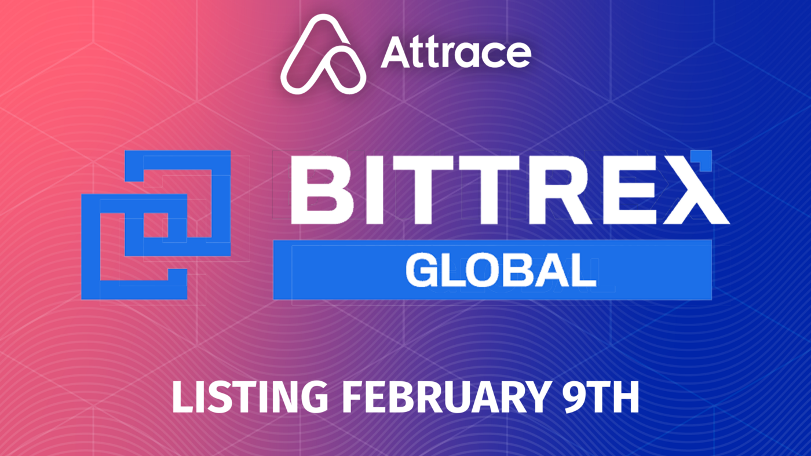

We are pleased to announce that the $ATTR token is now tradable on [Bittrex Global](https://global.bittrex.com/Market/Index?MarketName=USDT-ATTR)!

This marks the beginning of $ATTR listings on centralised exchanges with the aim to make the $ATTR token accessible to a wider audience and improve liquidity.

The trading pair on Bittrex will be $USDT/$ATTR so this is the first time $ATTR can be traded directly vs a stable coin.
<!--truncate-->
## About Bittrex Global
Bittrex operates a world class cryptocurrency exchange with a focus on security and trust. Founded in 2014 by three cybersecurity engineers, Bittrex employs the most reliable, effective security technologies available. The platform leverages an elastic multi-stage wallet strategy to ensure that the majority of funds are kept in cold storage for additional safety, enables two-factor authentication for all users and provides a host of additional security features for multiple layers of protection.

Bittrex Global is fully regulated under EU and Liechtenstein laws.

### Bittrex Global Channels

- TG Announcement: https://t.me/bittrexglobal
- Twitter: https://twitter.com/BittrexGlobal
- LinkedIn: https://www.linkedin.com/company/bittrexglobal/
- Facebook: https://www.facebook.com/BittrexGlobal/
- Instagram: https://www.instagram.com/bittrex_global/

## Accessibility For All
The Bittrex listing marks a pivotal moment for the $ATTR token as it further improves a key element to the growth of the Attrace community: Accessibility. These days, everyone in the cryptocurrency community can feel the effects of high gas fees on the Ethereum blockchain, making decentralised exchange options such as Uniswap and Sushiswap not feasible for everyone due to the swap costs involved. With the $ATTR Bittrex Global listing, there is now a cheaper way to trade in $ATTR whilst maintaining trust on a well established and reputable platform.

## About Attrace
Attrace unlocks the value of “word of mouth” marketing in web3 by linking promotions with the on-chain user activity.

Web3 brings opportunities to channel value directly to those who contribute to crypto projects and creators, by spreading the word about their decentralized apps or crypto assets. Whether the communication happens via web2 channels (i.e. Twitter, Websites), web3 channels or via Metaverse, Attrace will be able to capture the value add of word-of-mouth marketing that leads to web3 activity. The network of Verifier Nodes observes and captures the value of user acquisition in web3 that happens via link sharing (value of social graph in web3).

Attrace is currently live on Ethereum and Polygon and supports (cross-chain) referrals for buy and hold of any crypto or NFT project, with connections to BSC and Solana to follow soon. The agnostic network will progressively integrate with all major smart chain networks to eventually become a standard for web3 marketing in the crypto space

