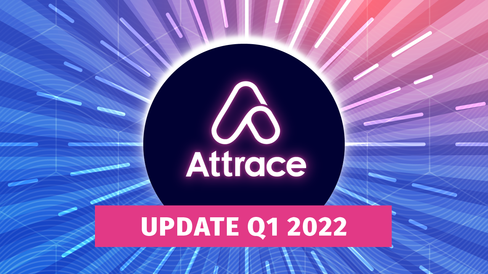

In the last product update, the Attrace team outlined its vision to evolve the web3 referrals towards “word of mouth” marketing for web3, in combination with the introduction of Referral Farms.

Since then, the Attrace development team has been working extensively on the product upgrades, and is now very close to releasing the first iteration that will set in motion a larger adoption of the Attrace protocol

<!--truncate-->
## Referral Farm contract

Last Monday, the first ReferralFarmsV1 contract with a Single-Token Referral Farm was released on Rinkeby. This week, the team has been preparing for the first test run with partner Mask.io (the web3 Twitter layer). For the first release, the updated contract will start solely with supporting crypto tokens on Ethereum (i.e. ERC20). More will be explained in the coming update.

## Oracle updates

Monumental work related to Oracles has been completed. Oracles are now able to fully detect Referral Farm positions based on the tokens bought via referrals. This is the most important technical link between Oracles and Referral Farms. For those looking for the bigger picture: Oracles are now able to measure the effect and value-add of “word of mouth” marketing in web3 by linking promotions with the on-chain user activity.

