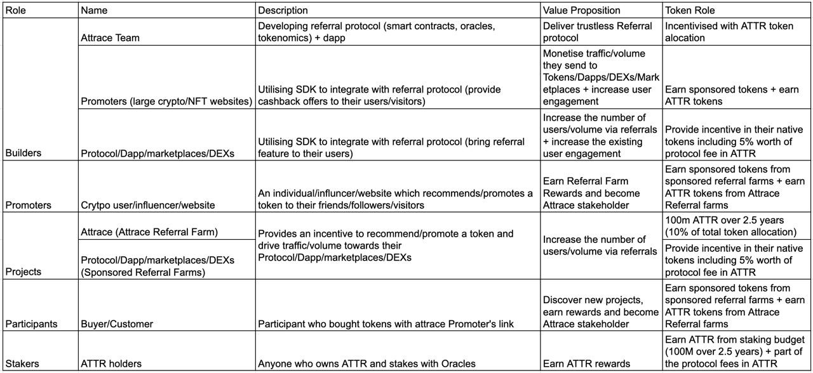

## Release of Referral Farming and Mask Integration
As previously announced, the referral farming feature was released on Rinkeby and currently is in the testing phase. After a successful test on Rinkeby with Mask Network, the team will release Referral Farms on Ethereum. The launch of the Referral Farms will begin with a **Single Token Referral Farms** feature which will be available via the Mask browser plugin to its users on Twitter.

Upon the launch of the Referral Farms, this feature will be available for any project or protocol using Mask Network that is looking to incentivise and reward successful referrals of their token. The Attrace team is excited about this collaboration, given the very obvious synergy between both projects.

<!--truncate-->

In addition, the Attrace team plans to expand the Referral Farm contracts to cover Multi Token Referral Farms during this quarter. These farms are most suitable for ecosystems hosting token exchanges that are willing to incentivise traffic/volume towards their protocols (e.g., DEX, Marketplaces). The launch will be accompanied by **Attrace Referral Farm**, the $ATTR native multi token farm, which will be available via Mask and of course via our new Attrace App (more below). Furthermore, the team is planning to include NFT collections in subsequent iterations of Referral Farm contracts. More will be explained in future updates.

## Attrace Governance to go live
As part of the release of Attrace Referral Farm, the Attrace team will also officially launch the **Attrace Governance model that will enable any $ATTR token holder to get engaged in the governance of the project**.

The first Governance topic will be: Which tokens should be eligible to join the Attrace Referral Farm? Any Attrace token holder will be able to vote on which tokens should join the Attrace Referral Farm and be eligible for the rewards. As a reward to the users of the protocol, 10% of all tokens, 100M $ATTR, will be distributed over the next 30 months (plus part of the protocol fees from single token referral farms). _A small reminder: these $ATTR rewards are only applicable to kickstart the protocol, as we expect that the protocol will become sustainable on the basis of protocol fees over time._

This is the first step in progressing towards a DAO, making the $ATTR token holders eligible to decide on the future of the Attrace protocol. In Q2, the Attrace team will announce and release the governance model, with explanation on how to nominate and vote on tokens that should become part of Attrace Referral Farm. The team is excited to include all token holders in the decision making for the future of the first Referral Protocol for web3 — DAO is coming!

### Integration with DappRadar
Another exciting planned partnership is the collaboration with DappRadar. The plan is a full integration of the DappRadar website with the Attrace protocol, by utilizing single token referral farms. This means that DappRadar users will be able to take part in referral farming by adding value to DappRadar’s ecosystem and partners. At the same time, this will also benefit the Attrace ecosystem by growing the network effect as well the number of users, in addition to the protocol fees generated from the referral farms themselves. Furthermore, we believe that this partnership has great potential and can lead to amazing opportunities for both parties. More details will be shared in the coming period.

### Attrace App and Website revamp
The very significant protocol update will be accompanied by an update to the overall user experience and the look and feel of the website. In early Q2, we will release a complete overhaul of the Attrace app and website. Once live, anyone with a wallet will be able to interact with Referral Farms, starting with Simple Token Farms and later on with Multi Token Farms (i.e., Attrace Referral Farm). It will be as simple as: Use an Attrace link when recommending a token and earn the farming rewards. We believe that this will be a perfect chance to grow our community with real users. At that stage, anyone out there who talks about crypto and NFTs via any channel (web2 or web3) should be using Attrace links when recommending/engaging with friends, family or followers. The Attrace team has spent considerable time thinking about how to properly incentivise the usage of the Attrace application. There is a strong belief, also among key investors, that all the pieces will come together with the release of the new Referral Farm app.

### Running Oracles
Following the release of the top priority referral farming features and Mask integration, the Attrace team will complete the work required to enable the Oracles to be publicly run, meaning that anyone can start capturing the value of “word of mouth” marketing in web3.

The initial stage of Oracle network release will begin with Oracle nomination. Here, Attrace token holders will be able to:

Nominate themselves to run an Oracle (operate a node and stake ATTR), Or
Vote for an Oracle by delegating their stake to that Oracle.
Each nominated Oracle will be required to have a sufficient amount of ATTR staked before officially becoming an Oracle. As staking ATTR will play a crucial role in securing the protocol and the future Total Value Locked in the referral farms, there will be a minimum amount of stake required before the Oracle network is activated. More details will be announced soon.

Attrace Stakeholder Map
This is an overview of different roles within Attrace protocol and how each interacts with $ATTR:

## Referral Farm contract

Last Monday, the first ReferralFarmsV1 contract with a Single-Token Referral Farm was released on Rinkeby. This week, the team has been preparing for the first test run with partner Mask.io (the web3 Twitter layer). For the first release, the updated contract will start solely with supporting crypto tokens on Ethereum (i.e. ERC20). More will be explained in the coming update.

## Oracle updates

Monumental work related to Oracles has been completed. Oracles are now able to fully detect Referral Farm positions based on the tokens bought via referrals. This is the most important technical link between Oracles and Referral Farms. For those looking for the bigger picture: Oracles are now able to measure the effect and value-add of “word of mouth” marketing in web3 by linking promotions with the on-chain user activity.

