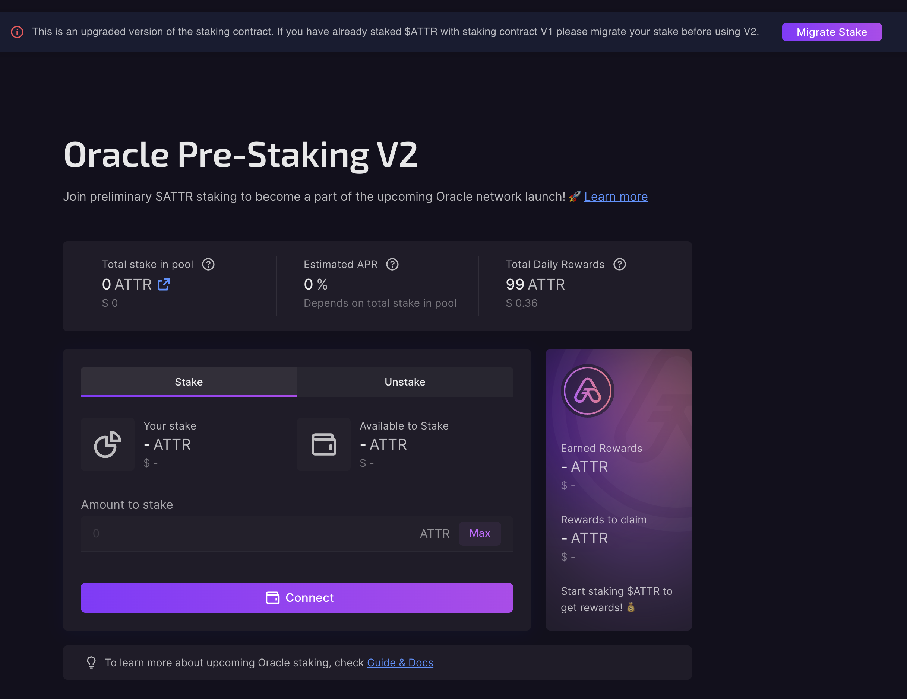

On June the 25th, after more than 3 years and more than $4 Million of investment, Attrace.com launched the trustless Referral Protocol for web3. This was the first MVP that was functioning exactly as envisioned by the Attrace team years ago: Trustless verification from a 3rd party perspective (!), fully transparent and in essence capable of facilitating any sale of any on-chain asset or service in web3. 

<!--truncate-->
The MVP of the protocol is now live on the Ethereum network, with referral links for fungible assets sold on decentralised exchanges (DEX) like Uniswap and Sushiswap. So now, for the first time, projects with assets sold via a DEX can offer promoters a performance based marketing solution.
 
Project, Promoter and Buyer can very easily work via the app https://app.attrace.com/farms in a couple of steps via a wallet. We have created some videos explaining the few steps to use the protocol: 
 
1. [Create Farm Flow](https://youtu.be/XiXuQS_Kml4)
1. [Refer to Earn Flow](https://youtu.be/rC-h0_Pd3q8)
1. [Buy to Earn Flow](https://youtu.be/0IGnWQddOoI)

We are rather pleased to announce that since the launch the app has been working flawlessly, a huge compliment to the Attrace dev team. 

The SDK for full integration with partners is also already live. Mask.io was the first to fully integrate with the Attrace Protocol and there are at least two large integrations to be expected in this quarter.

# First traction
The day the Attrace MVP launched was, as you might recall, around the beginning of the bear market. Nevertheless, the first conversion numbers - a completely new online marketing methodology in a market with very little to zero appetite for Altcoins - look promising. As of today 298 promoters signed up via the App with a sign-up conversion rate of more than 17%. Also the buyer conversion rate of 8% looks promising, especially given that in web2 an average buyer conversion rate of 1% is already considered high. It is now simply a matter of waiting for the Altcoin market to pick up. 

Then there is the traction of projects seeking an alternative marketing solution…

# Roadmap
Throughout the last 1.5 years Attrace has had meetings with approximately 200 other projects who were looking for an alternative marketing solution. As a result, Attrace has a total of 118 projects in CRM waiting to connect with the protocol. 

A large part of these requests we cannot deliver - yet. Different networks which are not live yet or a request for a slightly different use case. And here it arguably gets interesting, because all that has been requested can effectively be facilitated with the Attrace Protocol. It is simply a matter of time and development power.

All requests Attrace received can be divided in 4 use cases:  
* **Refer users to NFT Marketplaces (DEXs live already on ETH)**, e.g. referral links to NFTs being sold on decentralised NFT marketplaces
* **Refer users to a smart contract (!) e.g. staking, farming and lending protocols**, like referral links to deposit tokens into AAVE lending pools  
* **Attrace can help DEX and NFT marketplace aggregators with getting paid**, Attrace can integrate a referral system that would enable DEXs to incentivise trading volumes based on pricing (farming rewards would improve the pricing of the DEXs on the aggregator platforms, making them more competitive) which would effectively result in DEXs competing for the traffic/traders that come in via the aggregators 
* **Refer users to a blockchain/network**, e.g. referral links to bridge tokens to Avalanche network

And that brings us to our general roadmap for the future: 

:::info
Aim is to be a first mover in all these verticals on all main networks (ETH, BSC, Solana etc.) which would make Attrace the Web3 Marketing Infrastructure play.

The decision which use case or which network to facilitate first is completely subjected to market demand and will be decided on a monthly basis. 
:::

# Deliveries after the launch on 25ht of June

### Attrace launched a “Buy to Earn” feature in the Attrace app 

This is effectively a “cash-back for web3 assets” page, check this out [here](https://app.attrace.com/buy-to-earn) 

* It is basically a page on the Attrace app where Attrace acts as a Promoter for the Attrace community, so the community can earn referral farming rewards in case they consider buying Projects that have set up referral farms 
* More importantly: It is a showcase for websites who can now effectively set up a “cash-back for web3 assets” webpage by placing Buy to Earn referral links. Cash-back marketing is part of performance based marketing and a multi-billion dollar market in web2 on itself. 

### Staking Contract Upgrade
Beginning of this year, Attrace launched the staking contract V1. Over the last couple of months, these staking conditions have expired, the contract code required some upgrades in order to guarantee payouts and it is slowly time to prepare for the actual staking within the Attrace Oracles (for additional staking rewards driven by protocol network fees). 
Therefore, we are about to release the new contract plus a migration front-end. This will allow the user to transfer their stake from the old contract to version 2. The new contract will have no unstake penalty, in other words, users are free to stake and unstake whenever they see fit.

In the below a screenshot of the Pre-Staking V2 interface that is currently running in testnet environment.

 

Expect the announcement of the new staking in a matter of days. 
 
# Coming month: 

### Next vertical 
Referring to the use cases mentioned in the above. We have decided on the next vertical to be developed which we will disclose once live (for strategic reasons).  

### Partnerships
We have been planning and anticipating the launch of a pilot product with two large partners in the crypto space. However, it is taking both partners longer than expected to finalise and launch those efforts (bear market slows down development time). We will certainly share more once there is enough clarity on the launching date. 

# To conclude 
We are in a bear market, which was frankly rather unfortunate given the timing of the MVP launch. However, we have a positive outlook for the longer term future. The vision we had years ago seems to be confirmed and what we have delivered works exactly as we hoped for.

It is now simply a matter of getting through the bear and developing as many additional use cases as possible to assure they will be live by the time Altcoin season picks up. 

